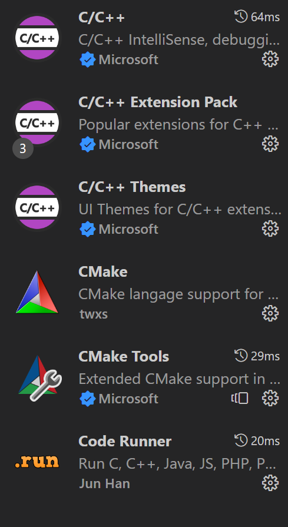

# VSCode、VS和Matlab安装，C++环境配置，C++库函数打包发布及使用

[TOC]

## 一、VSCode、VS和Matlab安装

### 1.VSCode安装

访问[VSCode](https://code.visualstudio.com/)官网下载，官网下载地址：[Download Visual Studio Code - Mac, Linux, Windows](https://code.visualstudio.com/download)

### 2.VS安装

访问[Visual Studio](https://visualstudio.microsoft.com/zh-hans/vs/)官网下载，官网下载地址：[下载 Visual Studio Tools - 免费安装 Windows、Mac、Linux (microsoft.com)](https://visualstudio.microsoft.com/zh-hans/downloads/)


另外，离线版安装方式：[Create an offline installation - Visual Studio (Windows) | Microsoft Learn](https://learn.microsoft.com/en-us/visualstudio/install/create-an-offline-installation-of-visual-studio?view=vs-2022)

既可以使用UI，也可以使用命令行的方式获得，命令行的方式如下：

```
VSProfessional2022.exe --layout --add Microsoft.VisualStudio.Workload.NativeDesktop --includeRecommended --lang zh-cn
```

其中，`VSProfessional2022.exe`是下载的安装exe，名称可以自己更改；`--layout`指定部署的位置，默认与安装程序的位置相同；`--add`指定要下载的模块id；`--includeRecommended`指定使用推荐配置；`--lang`指定使用的语言。

### 3.Matlab安装

访问[matlab](https://ww2.mathworks.cn/products/matlab.html)官网，官网下载地址：[下载 MATLAB、Simulink、Stateflow 和其他 MathWorks 产品](https://ww2.mathworks.cn/downloads/)

## 二、驱动和环境安装配置

### 1.VSCode环境配置

如果使用VSCode配置C++编译环境，需要下载GCC编译器，基于windows的编译器有MinGW、MinGW-W64和TDM-GCC等，其中MinGW是针对32位操作系统的，而MinGW-W64是针对64位操作系统，TDM-GCC是衍生自MInGW系列的项目，也包含了GCC编译器。TDM-GCC的跟新频率不如MInGW-W64，因此这里推荐MInGW64编译器。

[MInGW-W64]()官网中选择`Downloads`、`Sources`中的`SourceForge`，下载MinGW-W64 GCC-8.1.0下的[x86_64-win32-seh](https://sourceforge.net/projects/mingw-w64/files/Toolchains targetting Win64/Personal Builds/mingw-builds/8.1.0/threads-win32/seh/x86_64-8.1.0-release-win32-seh-rt_v6-rev0.7z)并解压到固定位置。

另附TDM-GCC的下载地址：[Download | tdm-gcc (jmeubank.github.io)](https://jmeubank.github.io/tdm-gcc/download/)。

系统变量设置：将下载好的VCCode、MinGW或TDM-GCC编译器添加到系统环境变量（`path`）中，例如：

```
D:\Program Files\Microsoft VS Code\bin
D:\MinGW\x86_64-8.1.0-release-win32-seh-rt_v6-rev0\mingw64\bin
D:\TDM-GCC-64\bin
```


使用VSCode进行C++编程时，一般使用CMake进行编译和链接的管理。

CMake下载地址：[Download CMake](https://cmake.org/download/)

下载完成后也需要将CMake添加到系统环境变量（`path`）中，例如：

```
D:\Program Files\CMake\bin
```


由于使用CMake构建项目，在编译、链接和生成可执行（库）文件时，需要进入到`build`文件夹使用命令`rimraf CMakeFiles` 、`cmake .` 、`make`，其中rimraf和make都需要下载。

[rimraf](https://www.npmjs.com/package/rimraf)是一个`node.js`库，以包的形式包装rm -rf命令。可以使用包管理器npm进行下载，npm是`Node.js`包的标准发布平台。

`node.js`的下载地址：[Node.js (nodejs.org)](https://nodejs.org/en)，在`cmd`中使用命令`npm install rimraf -g`进行`rimraf`的全局安装。

node.js也需要加入到系统环境变量（`path`）中：

```
C:\Program Files\nodejs\
```


[make](https://www.gnu.org/software/make/)的下载地址：[Make for Windows (sourceforge.net)](https://gnuwin32.sourceforge.net/packages/make.htm)，MinGW-w64的bin文件中也包含有make，其名为`mingw32-make.exe`。如果使用前者，则将其加入到环境变量中：

```
D:\Program Files (x86)\GnuWin32\bin
```

如果使用后者，可以使用命令`cp mingw32-make.exe make`来适配上述命令，或将上述命令中的make改为此处的名字。


启动VSCode，下载C++编译环境所需要的插件，如下：



### 2.VS环境配置

将下载好的VS加入到系统环境变量（`path`）即可，必要的环境已经在安装（选择桌面级C++开发选择）时由安装系统自动构建好了。

***🛠️缺少示例图***

### 3.Matlab环境配置

如果需要Matlab使用C++函数接口，则应该为Matlab配置C++编译器。对于Windows 64位平台，可以选择MinGW-w64或TDM-GCC，这里以TDM-GCC为例，MinGW-w64配置操作类似。

在系统环境变量中添加如下变量：

```
变量名(N): MW_MINGW64_LOC
变量值(V): D:\TDM-GCC-64
```

其中`变量值`是GCC编译器的安装地址，或者也可以使用其bin目录`D:\TDM-GCC-64\bin`。

注意，也需要将Matlab添加到系统环境变量（`path`）中去：

```
D:\Program Files\MATLAB\R2023a\bin
```

添加完系统环境变量后，在Matlab中输入如下命令：

```
# setenv('MW_MINGW64_LOC','folder')
setenv('MW_MINGW64_LOC','D:\TDM-GCC-64')
```

使用`mex -setup`命令完成编辑器配置。

## 三、C++工程构建方式

### 1.工程文件

使用VScode配合CMake构建C++工程，一般包含如下文件：`.vscode`下的`c_cpp_properties.json`、`task.json`、`launch.json`、`settings.json`，`build`文件夹，`CMakeLists.txt`以及其他C++程序和头文件等。

### 2.快速构建CMakeLists.txt和build文件夹

可以使用命令`CMake: Configure with CMake Debugger`来选择CMake依赖的编译器（后一步包好了这一步，所以也可以不执行这一步），然后使用`CMake: Quick Start`来快速生成一个模版，包含`CMakeLists.txt`、`build`文件夹和一个CPP程序。

其中，需要填写项目名称、选择C或C++工程以及选择构建运行函数或库。

一个即构建运行函数，又构建库的`CMakeLists.txt`如下：

```
cmake_minimum_required(VERSION 3.20) 			# 限制最低版本
project(test VERSION 0.1.0 LANGUAGES C CXX) 	# 工程名

include(CTest) 
enable_testing()								# 启用测试功能

# 添加搜索头文件暂时的根目录
include_directories(D:/Projects/Projects_C/IDE_VScode/LibCommonFunction)

# 添加库
add_library(mylib STATIC SpecificFunction.cpp) # STATIC 静态，SHARED 动态链接库

# 添加运行函数
add_executable(test01 main.cpp)

# 链接库
target_link_libraries(test01 PRIVATE
D:/Projects/Projects_C/IDE_VScode/LibCommonFunction/build/libCommonFunction.a 
mylib) # PRIVATE 私人 INTERFACE 接口 PUBLIC 两者


set(CPACK_PROJECT_NAME ${PROJECT_NAME})			# 设置包名称，此处为项目名称
set(CPACK_PROJECT_VERSION ${PROJECT_VERSION})	# 设置包版本，此处为项目版本
include(CPack)
```

注意，在链接库时，前者是另外一个库项目生成的静态链接库，需要输入完整的地址，后者是此处构建的库，需要输入库的名称。


### 3.c_cpp_properties.json

可以使用命令`C/C++: Edit Configurations (UI)`或者`C/C++: Edit Configurations (json)`完成该文件的设置。

主要注意修稿`"compilerPath"`和`"intelliSenseMode"`，前者是设置C++编译器地址，后者是选择智能感知模式。

```
{
    "configurations": [
        {
            "name": "Win32",
            "includePath": [
                "${workspaceFolder}/**"
            ],
            "defines": [
                "_DEBUG",
                "UNICODE",
                "_UNICODE"
            ],
            "compilerPath": "D:\\MinGW\\x86_64-8.1.0-release-win32-seh-rt_v6-rev0\\mingw64\\bin\\g++.exe",
            "cStandard": "c17",
            "cppStandard": "gnu++14",
            "intelliSenseMode": "gcc-x64"
        }
    ],
    "version": 4
}
```

### 4.task.json

可以使用命令`Tasks: Configure Task`来完成任务配置，此处主要是实现CMake的一建编译、链接和生成操作，也可以不设置`task.json`，在控制台中一步一步输入命令也可以完成编译、链接和生成可执行文件（或库文件）。

```
{
	"version": "2.0.0",
	"tasks": [
		{
			"type": "shell",
			"label": "test",
			"command": "cd ${workspaceFolder}/build && rimraf CMakeFiles && cmake . && make",
			"group": "test",
		}
	]
}
```

注意，如果不想要在`CMakeLists.txt`中每次都添加`set(CMAKE_GENERATOR "MinGW Makefiles")`来设置CMake的生成器，可以在系统环境变量中添加如下变量：

```
变量名(N): CMAKE_GENERATOR
变量值(V): MinGW Makefiles
```

这样在生成CMake的配置文件后，会自动将`CMAKE_GENERATOR` 设置为`MinGW Makefiles`。

### 5.settings.json

如果不做配置，该文件会自动生成，提供该工程VSCode基本配置，以及各插件的配置。

## 四、Matlab使用C++库函数接口

### 1.动态链接库

一般会将C++函数库打包成动态链接库(dll)，以供其他软件调用使用。CMakeLists.txt如下：

```
cmake_minimum_required(VERSION 3.20)                # 限制最低版本
project(MatlabCDll VERSION 0.1.0 LANGUAGES C CXX)   # 工程名

include(CTest)
enable_testing()                                    # 启用测试功能

 add_library(MatlabCDll SHARED MatlabCDll.cpp)     # 添加链接库，SHARED表示添加动态链接库,
# add_library(MatlabCDll STATIC MatlabCDll.cpp)       # STATIC表示静态链接库

set(CPACK_PROJECT_NAME ${PROJECT_NAME})             # 设置包名称，此处为项目名称
set(CPACK_PROJECT_VERSION ${PROJECT_VERSION})       # 设置包版本，此处为项目版本
include(CPack)

```

为了让matlab识别到dll中的函数，库中源程序对应的头文件的形式有一些区别，如下：

```
#ifndef MATLAB_C_DLL_H
#define MATLAB_C_DLL_H


#ifdef __cplusplus 	// __cplusplus 是cpp中的自定义宏，表示这是个cpp的代码
extern "C++"  // 这是c++支持的指定语言链接性的说明符号（extern 引用声明符号），此处是说明后续函数使用C++语言链接性，
{			  // extern 函数原型：默认使用C++语言链接性；extern "C" 函数原型：使用C语言链接性
#endif		  // 如果后续函数是使用C语言写的，或者来自C的库，此处应该更换为extern "C"
	// 在提供者那里方法应该被声明为__declspec(dllexport)，在使用者那里，方法应该被声明为__declspec(dllimport)
	__declspec(dllexport) int say_hello(); // 函数原型
	
#ifdef __cplusplus
}
#endif

#endif
```

### 2.Matlab调用dll库

使用Matlab调用dll库的函数和方法如下：

针对C库：

|      函数名      |                         含义                         |
| :--------------: | :--------------------------------------------------: |
|   loadlibrary    |               将 C 共享库加载到 MATLAB               |
|  unloadlibrary   |                从内存中卸载共享 C 库                 |
|     calllib      |                调用 C 共享库中的函数                 |
|   libfunctions   |              返回 C 共享库中函数的信息               |
| libfunctionsview |            在窗口中显示 C 共享库函数签名             |
|   libisloaded    |               确定是否已加载 C 共享库                |
|    libpointer    |               用于 C 共享库的指针对象                |
|    libstruct     | 将 MATLAB 结构体转换为 C 样式的结构体以用于 C 共享库 |

针对C++库

|              函数名               |                    含义                     |
| :-------------------------------: | :-----------------------------------------: |
|             clibArray             | 为 C++ 数组或 std::vector 创建 MATLAB 对象  |
|         clibConvertArray          | 对于 C++ 数组，将数值数组转换为 MATLAB 对象 |
|            clibIsNull             |            确定 C++ 对象是否为空            |
|          clibIsReadOnly           |           确定 C++ 对象是否为只读           |
|            clibRelease            |          从 MATLAB 中释放 C++ 对象          |
|          underlyingValue          |  在 MATLAB 中创建的 C++ 枚举对象的基础数值  |
| clibgen.generateLibraryDefinition |            为 C++ 库创建定义文件            |
|      clibgen.buildInterface       |   在没有定义文件的情况下创建 C++ 库的接口   |

更多内容见[mathworks官网](https://ww2.mathworks.cn/help/matlab/call-c-library-functions.html?s_tid=CRUX_lftnav)

一个例子如下：

将dll库文件和库中源文件对应的头文件加入到matlab工作目录下。

```
if ~(libisloaded('libMatlabCDll')) %判断是否加载成功
    loadlibrary('libMatlabCDll','MatlabCDll.h')    %加载库
end
% libfunctions('libMatlabCDll')
calllib('libMatlabCDll', 'say_hello')
if libisloaded('libMatlabCDll') %判断是否加载成功
    unloadlibrary('libMatlabCDll')    %卸载库
end
```

